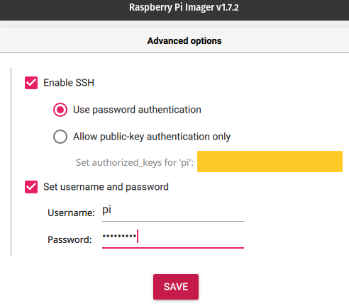

# rpi-ansible-playbooks

[](https://lbesson.mit-license.org/)

Ansible role to setup and configure a fresh Raspberry Pi (RPI)  
Please read this documentation carrefully before executing any playbook!

- [Assumption](#assumption)
- [Main purposes of this role](#main-purposes-of-this-role)
- [Explanation of the role](#explanation-for-each-role)
- [How to use](#how-to-use)
  - [First time using the role](#first-time-using-the-role)
  - [After the first used of this role](#after-the-first-used-of-this-role)
- [Resources used](#resources-used)

***

## Assumption

Since RPI OS (most of them) does not ship anymore with the default pi user --> more info [here](https://arstechnica.com/gadgets/2022/04/raspberry-pi-os-axes-longstanding-default-user-account-in-the-name-of-security/)  
You'll need to setup the new RPI with the Raspberry Pi [imager](https://www.raspberrypi.com/software/) software and use those advanced settings to create a first user :

  
*Please ensure to create a user called "pi" with password set to "raspberry" in order to run this role with the playbook and command below*

I also assume you have Ansible correctly setup on your local machine.  

***

## Explanation of the role

**For all tasks, you'll only need to edit the variables used in `defaults/main.yml` file**  
This role will execute in order:

- Update and upgrade the RPI  
No variable needed

- Install some apt packages  
Add packages you want to install within the `rpi_packages` variable

- Set the hostname of the RPI  
You can edit `rpi_hostname`

- Set a keyboard layout
Set the lyaout you want with the `rpi_keyboard_layout` variable. You can have a list of available layout with the ccommand : `localectl list-x11-keymap-layouts`  

- Create a user and push common configuration files for this user (like .bashrc, .vimrc files)  
Edit `rpi_new_user` and `rpi_common_files`.  
You'll also need to encrypt the password of this new user using : `ansible-vault encrypt_string "<password_for_user>"` and copy the result into the `rpi_new_user_passwd` variable. Please remember the string used for the encryption, it will be needed later to run the role.  

- Disable password authentication  
No variable needed

- Set a static IP for the RPI  
Edit `rpi_new_interface`,`rpi_new_ip`,`rpi_new_gateway` and `rpi_new_dns_servers`

- Feel free to contribute and add new useful tasks...

***

## How to use

You will not use this Ansible role in the same way if it's the first time you set up the rpi or not.

### First time using the role

First thing is to create a ansible.cfg file with this content, in order to skip host key verification (compulsory if ansible use password authentication) :  
```
[defaults]
host_key_checking = False
```

Here I suppose you're starting with a fresh new install of the RPI, and the only existing user is the one you setup with the OS Imager, as described in [Assumption](#assumption). A playbook executing this role can look like this :  

You can launch this playbook with the following command (from the root of this role)
> ansible-playbook --inventory=<your_rpi_local_ipv4>, --extra-vars "ansible_user=pi ansible_password=raspberry" setup_rpi.yml --ask-vault-pass

*You can find the IPv4 address of your rpi with the help of a network scanner like [AngryIpScanner](https://angryip.org/) or the famous [nmap](https://nmap.org/) tool*  
*Also, do not forget to add the comma `,` after <your_rpi_local_ipv4>*

***

### After the first used of this role

Inside this role, there is a task which create a new user and a ssh key pair to allow the user's authentication without password (password authentication is by the way deactivated within the role).  

Purpose is to retrieve the private key created in `ssh_keys folder` and add it to your local machine under `~/.ssh/` folder. Assuming this newx user created on the rpi is your current local user, you can do :  
> cp ssh_keys/rpi_keys_<rpi_new_user> ~/.ssh/  

You can then edit (or create) your `~/.ssh/config` file and add those lines to used the given ssh key pair without specifying the private key location.  
```
Host <rpi_hostname> <rpi_new_ip>
  Hostname <rpi_new_ip>
  User <rpi_new_user> 
  IdentityFile ~/.ssh/rpi_keys_<rpi_new_user>
```

Once that is done, you can now run the playbook (and enable other roles) with the following command :  
> ansible-playbook --inventory=<rpi_hostname>, setup_rpi.yml --ask-become-pass --ask-vault-pass

*The password you'll need to enter is the <rpi_new_user_passwd> pass you setup*

***

## Resources used

A big thanks to the authors of the following projects which helped me inspired me a lot :

- [AustinCloudGuru](https://github.com/AustinCloudGuru/ansible-role-splunk-forwarder)

- [vicchi](https://github.com/vicchi/ansible-pi-lockdown)

- [m0by314](https://github.com/m0by314/ansible_raspberry_pi_config)

- [acimadamore](https://github.com/acimadamore/ansible-role-raspberry-pi)
